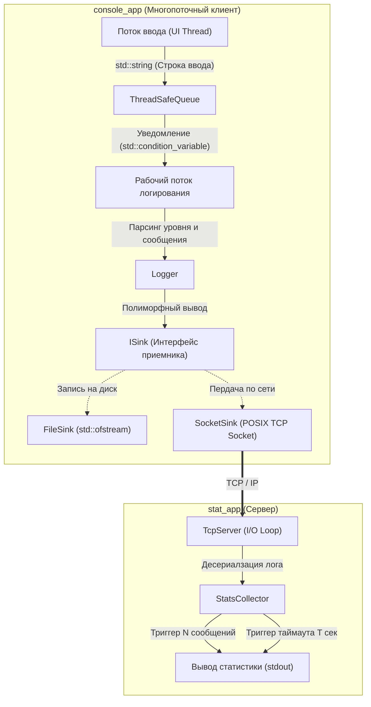

# Тестовое задание от ИнфоТеКС на стажировку Разработчик С++
[Ссылка на github](https://github.com/kex1tu/test_infotecs.DeveloperCpp)


[](https://en.cppreference.com/w/cpp/17)
[](CMakeLists.txt)
[](https://ninja-build.org/)
[](https://ubuntu.com)Реализ
[](#архитектурные-принципы)

Модульный программный комплекс на C++17, включающий в себя потокобезопасную библиотеку многоуровневого логирования (файл/сокет), консольное многопоточное приложение-клиент с потокобезопасной блокирующей очередью и сервер агрегации статистических метрик в реальном времени.

---

## Архитектура системы



---

## Архитектурные принципы и инварианты

1. **Стандарт C++17 и Pure STL**: проект не использует внешних сторонних библиотек. Сетевое взаимодействие построено на POSIX Sockets API с RAII-обертками (`UniqueFd`).
2. **Парадигма Zero-Exceptions**: бизнес-логика не использует `throw`. Все ошибки распространяются через детеминированные коды возврата и enum-структуры (`LoggerError`, `Result<T>`). Везде где могут генерироваться исключения стандартной библиотекой, используется `try-catch` блоки.
3. **Потокобезопасность (Thread Safety)**: обмен сообщениями между потоками в `console_app` изолирован через шаблонную очередь `ThreadSafeQueue` с использованием `std::mutex` и `std::condition_variable`.
4. **Принцип открытости/закрытости (OCP / Strategy Pattern)**: расширение способов доставки логов достигается реализацией интерфейса `ISink` (`FileSink`, `SocketSink`) без модификации ядра `Logger`.
5. **Memory Safety & RAII**: управление дескрипторами и буферами основано на семантике перемещения и умных указателях (`std::unique_ptr`). Проект проверен на отсутствие утечек в `valgrind`.

---

## Структура репозитория

```text
.
├── CMakeLists.txt                  # корневой CMake-файл сборки
├── README.md                       # документация проекта
├── .clang-format                   # правила форматирования кода (Google style)
├── .clang-tidy                     # конфигурация сттического анализатора
│
├── logger/                         # ЧАСТЬ 1: библиотека логирования (shared & static)
│   ├── CMakeLists.txt
│   ├── include/
│   │   ├── isink.hpp               # интерфейс приемника сообщений
│   │   ├── file_sink.hpp           # реализация записи в текстовый файл
│   │   ├── socket_sink.hpp         # реализация отправки логов через TCP-сокет
│   │   ├── log_level.hpp           # уровни важности (DEBUG, INFO, WARNING, ERROR)
│   │   ├── logger.hpp              # основной класс управления логированием
│   │   ├── logger_factories.hpp    # фабричные методы создания логгеров
│   │   ├── logger_error.hpp        # типизированные коды ошибок (No-Exceptions)
│   │   ├── thread_safe_queue.hpp   # потокоезопасная блокирующая очередь
│   │   └── unique_fd.hpp           # RAII-обертка над файловыми/сокетными дескрипторами
│   └── src/
│       ├── file_sink.cpp
│       ├── logger.cpp
│       └── socket_sink.cpp
│
├── console_app/                    # ЧАСТЬ 2: клиентское многопоточное приложение
│   ├── CMakeLists.txt
│   └── src/
│       ├── main.cpp                # точка входа, организация потоков
│       ├── utilities.hpp           # парсинг пользовательского ввода и cli-аргументов
│       └── utilities.cpp
│
├── stat_app/                       # ЧАСТЬ 3: сервер сбора и расчета метрик
│   ├── CMakeLists.txt
│   ├── include/
│   │   ├── tcp_server.hpp          # мультиплексирующий TCP-сервер приема логов (poll)
│   │   ├── stats_collector.hpp     # расчет метрик (N, T, min/max/avg, окна времени)
│   │   └── utilities.hpp           # валидация аргументов и парсинг таймстемпов
│   └── src/
│       ├── main.cpp
│       ├── stats_collector.cpp
│       ├── tcp_server.cpp
│       └── utilities.cpp
│
├── tests/                          # модульные и интеграционные тесты
│   ├── CMakeLists.txt              # корневой CMake-файл для запуска тестов
│   ├── tests.hpp                   # минималистичный безисключительный assert-фреймворк
│   ├── test_logger.cpp             # тестирование ядра логгера и уровней фильтрации
│   ├── test_socket_sink.cpp        # тестирование сетевого синка и передачи данных
│   ├── test_stat_app.cpp           # тестирование агрегации метрик и окон времени
│   ├── test_thread_safe_queue.cpp  # тестирование очереди
│   └── test_utilities.cpp          # тестирование парсинга и вспомогательных функций
│
└── .github/workflows/              # CI/CD пайплайны сборки и тестирования
    └── cmake-single-platform.yml
```

---

## Требования к окружению

Для сборки и запуска потребуется Linux-окружение (Ubuntu 20.04/22.04 LTS или Debian 11/12):

```bash
# базовые инструменты сборки
sudo apt-get update
sudo apt-get install -y build-essential cmake ninja-build g++

# инструменты статического анализа и профилирования (рекомендуется)
sudo apt-get install -y clang-format clang-tidy valgrind
```

---

## Сборка проекта

### Сборка всех компонентов (Ninja / Make)
```bash
# конфигурация с генератором Ninja
cmake -S . -B build -G Ninja -DCMAKE_BUILD_TYPE=Release
cmake --build build -j $(nproc)

# стандартный Makefile
cmake -S . -B build -DCMAKE_BUILD_TYPE=Release
cmake --build build -j $(nproc)
```

### Таргетная сборка отдельных модулей
```bash
cmake --build build --target logger_static logger_shared # сборка библиотек
cmake --build build --target console_app                 # сборка клиента
cmake --build build --target stat_app                    # сборка сервера статистики
```

---

## Запуск и использование

### 1. Демонстрационный сценарий

Откройте два окна терминала для проверки сетевого взаимодействия и расчета телеметрии:

**Терминал 1 — Сервер сбора статистики (`stat_app`):**
```bash
# параметры: ip=127.0.0.1, port=8080, N=3 сообщения, T=5 секунд таймаут
./build/stat_app/stat_app 127.0.0.1 8080 3 5
```

**Терминал 2 — Клиент логирования (`console_app`):**
```bash
# подключение к серверу с уровнем важности по умолчанию INFO
./build/console_app/console_app --socket 127.0.0.1 8080 INFO
```

**Интерактивный ввод в Терминале 2:**
```text
[INFO] Application launched successfully
[WARNING] High memory usage detected (85%)
[ERROR] Database connection lost: timeout
```

**Результат в Терминале 1:**
Сервер выведет в консоль каждое полученное сообщение в реальном времени, а при достижении порога $N=3$ (или по истечении таймаута $T=5$ сек) ообразит сводную статистику (распределение по уровням, длины сообщений: min/max/avg, счетчик за последний час).

---

### 2. Справочник параметров CLI

#### Сервер статистики (`stat_app`)
```bash
./build/stat_app/stat_app <address> <port> <n_messages> <timeout_sec>
```
| параметр | тип | описание | пример |
| :--- | :--- | :--- | :--- |
| `<address>` | IPv4 | IP-адрес интерфейса для bind (0.0.0.0 для всех) | `127.0.0.1` |
| `<port>` | uint16 | порт прослушивания TCP-сокетов | `8080` |
| `<n_messages>`| size_t | периодичность выдачи статистики по числу принятых сообщений ($N$) | `5` |
| `<timeout_sec>`| uint32 | таймаут ($T$, в сек) выдачи отчета при наличии изменений | `10` |

#### Клиент логирования (`console_app`)
```bash
# логирование в локальный файл:
./build/console_app/console_app --file <filepath> [DEFAULT_LEVEL]

# логирование в сокет:
./build/console_app/console_app --socket <address> <port> [DEFAULT_LEVEL]
```
- `[DEFAULT_LEVEL]` *(опционально)*: `DEBUG`, `INFO` *(по умолчанию)*, `WARNING`, `ERROR`.
- Для завершения работы введите в консоль команду `exit`.

---

## Тестирование

### Запуск тестов через CTest
```bash
ctest --test-dir build --output-on-failure -C Release --parallel $(nproc)
```

### Запуск модулей тестирования напрямую
```bash
./build/tests/test_logger              # тесты библиотеки и фильтрации уровней
./build/tests/test_thread_safe_queue   # тесты (многопоточные) очереди задач
./build/tests/test_socket_sink         # тесты передачи данных через сокет
./build/tests/test_stat_app            # тесты матеатики и расчета срезов статистики
./build/tests/test_utilities           # тесты парсеров аргументов и валидации
```

### Анализ памяти (Valgrind Memcheck)
```bash
valgrind --leak-check=full --show-leak-kinds=all --error-exitcode=1 ./build/tests/test_logger
valgrind --leak-check=full --show-leak-kinds=all --error-exitcode=1 ./build/tests/test_thread_safe_queue
```

---

## Соответствие требованиям технического задания

| Пункт ТЗ | Требование | Статус | Компонент реализации |
| :--- | :--- | :---: | :--- |
| **1.1** | Сборка библиотеки в виде static и shared | да | [logger/CMakeLists.txt](logger/CMakeLists.txt) |
| **1.2** | Параметры: файл лога, дефолтный уровень (enum, $\ge 3$) | да | [logger.hpp](logger/include/logger.hpp), [log_level.hpp](logger/include/log_level.hpp) |
| **1.3** | Формат записи: текст, уровень, точное время | да | [logger.cpp](logger/src/logger.cpp) |
| **1.4** | Динамическая смена уровня важности после инициализации | да | `Logger::set_default_level()` |
| **1.5\*** | (*Дополнительно*) Логиррование в сокет с единым API | да | [socket_sink.hpp](logger/include/socket_sink.hpp) (интерфейс `ISink`) |
| **2.1** | Консольное многопоточное приложение для проверки | да | [console_app/src/main.cpp](console_app/src/main.cpp) |
| **2.2** | Передача данных в поток записи через потокобезопасную очередь | да | [thread_safe_queue.hpp](logger/include/thread_safe_queue.hpp) |
| **3.1\*** | (*Дополнительно*) Сервер сбора статистик по сокету ($N$, $T$) | да | [stat_app/src/main.cpp](stat_app/src/main.cpp) |
| **Общие** | C++17, CMake, GCC, без сторонних библиотек, без исключений | да | STL-only |

<details>
<summary><b>Развернуть официальный текст технического задания</b></summary>

### Тестовое задание для стажера по направлению «Разработчик C++»

**Максимальное время на выполнение задания:** 1 неделя

#### Цель
Разработать библиотеку для записи сообщений в журнал с разными уровнями важности и приложение, демонстрирующее работу библиотеки.

---

#### Часть 1
Разработать библиотеку для записи текстовых сообщений в журнал. В качестве журнала использовать текстовый файл.

**Требования к разрабатываемой библиотеке:**
1. Библиотека должна иметь 2 варианта сборки: динамическая/статическая.
2. Библиотека при инициализации должна принимать следующие параметры:
   - a. Имя файла журнала.
   - b. Уровень важности сообщения по умолчанию. Сообщения с уровнем ниже заданного не должны записываться в журнал. Уровень рекомендуется задавать с помощью перечисления с понятными именами. Достаточно трех уровней важности.
3. В журнале должна быть сохранена следующая информация:
   - a. Текст сообщения.
   - b. Уровень важности.
   - c. Время получения сообщения.
4. После инициализации должна быть возможность менять уровень важности сообщений по умолчанию.
5. (*Дополнительно*):
   - a. Добавить реализацию с записью лога в сокет.
   - b. Интерфейс логирования через сокет не должен отличаться от интерфейса логирования в файл.

---

#### Часть 2
Разработать консольное многопоточное приложение для проверки библиотеки записи сообщений в журнал.

**Требования к приложению:**
1. Приложение должно:
   - a. Подключать и использовать библиотеку, реализованную в Части 1, для записи сообщений в журнал.
   - b. В консоли принимать сообщение и уровень важности этого сообщения от пользователя. Уровень важности может отсутствовать.
   - c. Передавать принятые данные от пользователя в отдельный поток для записи в журнал. Передача данных должна быть потокобезопасной.
   - d. Ожидать нового ввода от пользователя после передачи данных.
2. Параметрами приложения должны быть имя файла журнала и уровень важности сообщения по умолчанию.
3. Внутреннюю логику приложения придумать самостоятельно.

---

#### Часть 3 (*Дополнительно*)
Реализовать консольную программу для сбора статистик по данным из сокета (от библиотеки логирования из части 1.5).

**Требования к приложению:**
1. Приложение должно:
   - a. Принимать из сокета от библиотеки логирования данные.
   - b. Выводить в консоль принятое сообщение лога.
   - c. Выполнять подсчет статистик кол-ва сообщений:
     - i. сообщений всего
     - ii. сообщений по уровню важности
     - iii. сообщений за последний час
   - d. Выполнять подсчет статистик длин сообщений:
     - i. Минимум
     - ii. Максимум
     - iii. Средняя
   - e. Выводить в консоль собранную статистику:
     - i. после приема N-го сообщения
     - ii. после таймаута T секунд, при условии, что статистика изменилась с момента последней выдачи
2. Параметрами приложения должны быть параметры подключения для прослушивания сокета, значения N и T.

---

#### Требования к выполнению задания
- Программный код должен быть написан на языке C++ с использованием стандарта **C++17**. Следует придерживаться подходов ООП к разработке.
- Сборку проекта выполнять **cmake**. Для компиляции использовать компилятор **gcc**. Цели сборки библиотеки и тестового приложения должны быть разделены.
- В папке с исходным кодом не должно быть мусора: неиспользуемых файлов исходных кодов или ресурсов, промежуточных файлов сборки и т.д.
- **Не использовать никаких сторонних библиотек помимо stl.**
- **Не использовать исключения для реализации бизнес-логики.**
- В качестве целевой операционной системы, на которой будет проверяться тестовое задание, стоит рассматривать актуальные версии **ubuntu/debian**.
- Приложение должно корректно обрабатывать ошибки.
- Все файлы (исходный код библиотеки и приложения, cmake файлы) должны быть размещены в одном git-репозитории.

---

#### Оценка выполнения задания
Кандидат должен предоставить ссылку на git-репозиторий с выполненным заданием (части 1, 2 обязательно). Оценка будет проводиться на основе следующих критериев:
1. **Качество и читаемость кода.**
2. **Корректность работы приложения с различными входными данными.**
3. **Наличие и качество документации к выполненному заданию** (README-файл, комментарии в коде и т.д.).
4. **Наличие и качество юнит тестирования.**

</details>
